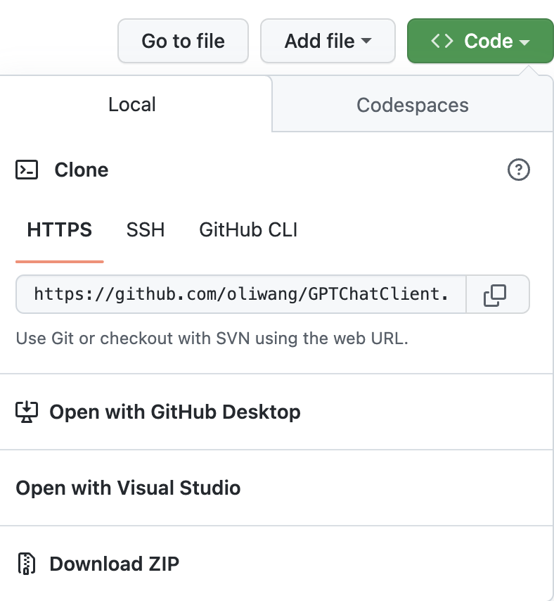
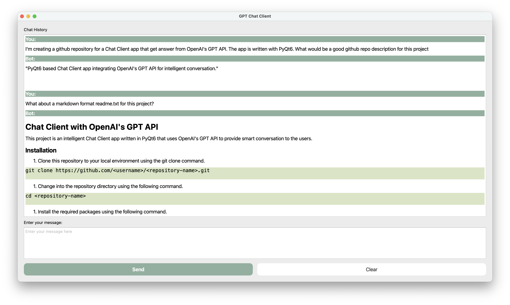
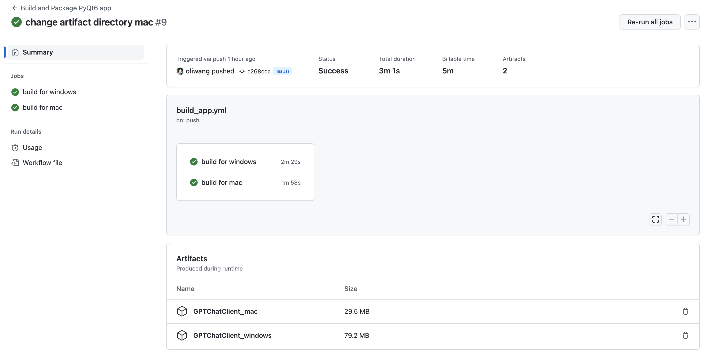
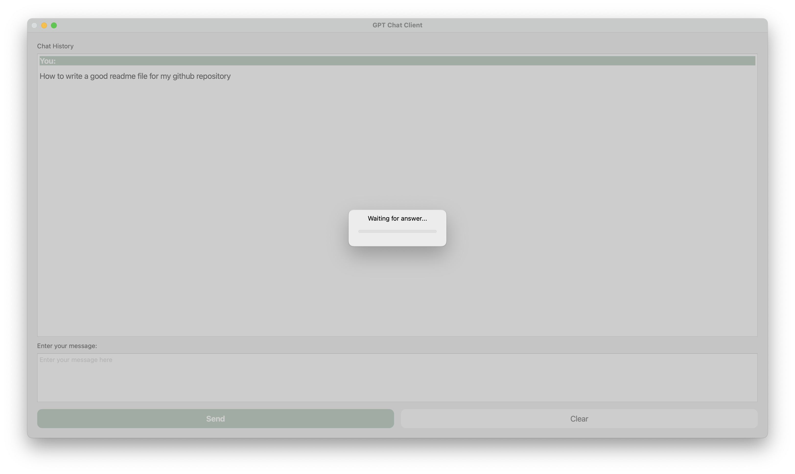

# GPTChatClient


Chat client desktop app built with OpenAI API and PyQt6.

# Installation


## 1. Download ZIP or clone repository

```bash
git clone https://github.com/oliwang/GPTChatClient.git
```



## 2. Modify `QT_Client_Chat.py`

If you are using a custom API endpoint, you need to specify it in `QT_Client_Chat.py`. For example, if you followed this tutorial [使用 Cloudflare Workers 解决 OpenAI 和 ChatGPT 的 API 无法访问的问题 · noobnooc noobnooc · Discussion #9](https://github.com/noobnooc/noobnooc/discussions/9).

Don't forget to enter your OpenAI API key.

```python
# add this line if you are using another API endpoint
# openai.api_base = ""

# enter your OpenAI API key here
openai.api_key = ""
```


## 3. Install dependencies

```bash
pip install -r requirements.txt
```

## 4. Run app

```bash
python QT_Client_Chat.py
```



> **Tip:** Previous conversations are sent to provide context. As your chat history becomes longer, more tokens are sent and it will cost you more. So if you are starting a different topic, press "Clear" to clear the history.

> **Hotkey:** Press `Shift+Enter` or press "Send" button to send message.

## 5. Package app

```bash
# mac
pyinstaller -n "GPTChatClient" --windowed --icon="icon.icns" QT_Client_Chat.py

# windows
pyinstaller -n "GPTChatClient" --windowed --icon="icon.ico" QT_Client_Chat.py
```

If you want to create a dmg file for mac, you can install `create_image` and run the provided `create_dmg.sh` script.

```bash
brew install create-dmg
bash create_dmg.sh
```


For details, refer to the following tutorials:
- [Packaging PyQt6 applications into a macOS app with PyInstaller](https://www.pythonguis.com/tutorials/packaging-pyqt6-applications-pyinstaller-macos-dmg/)
- [Packaging PyQt6 applications for Windows, with PyInstaller & InstallForge](https://www.pythonguis.com/tutorials/packaging-pyqt6-applications-windows-pyinstaller/)


### Automatic Build with Github Actions

If you want to build the app automatically everytime you push to Github, you can use Github Actions. This also comes in handy if you want to build the app for different platforms.

After the build, you can download the app from the artifacts section of the Github Actions page.



The workflow file is provided in [`.github/workflows/build_app.yml`](.github/workflows/build_app.yml). 

Or you can fork this repository and enable Github Actions in your forked repository.


# Bugs

- [ ] Windows version displays an empty dialog instead of showing a `QProgressDialog` with "Waiting for answer..." text.



- [ ] Windows version does not display message sent by user before showing progress dialog and receiving answer.

# License
GNU General Public License v3.0
